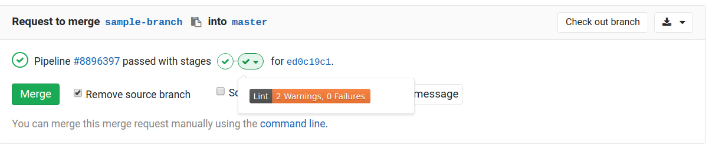

# GitLab External Status Client

Add extra details to a GitLab CI pipeline.

## Example

```bash
$(npm bin)/build-status shield --name "Lint" --desc "2 Warnings, 0 Failures" \
  --shield-color "orange"
```


*Inline shield powered by TamperMonkey script 'Inline Shields.io'*.
